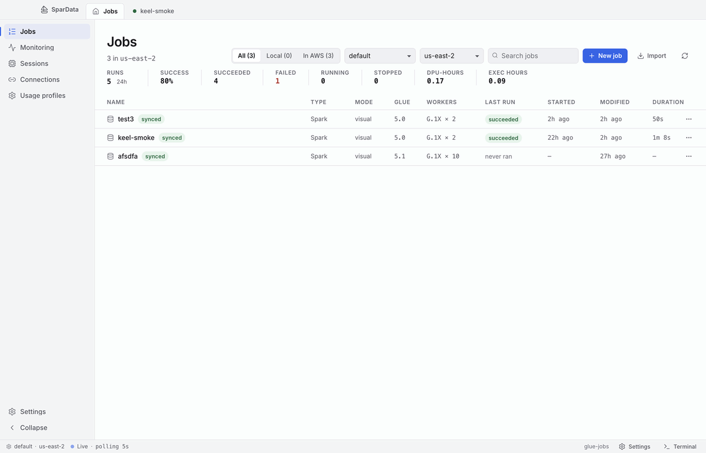
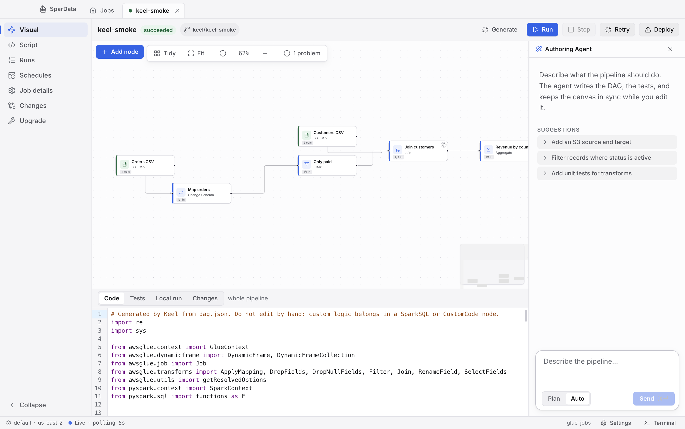
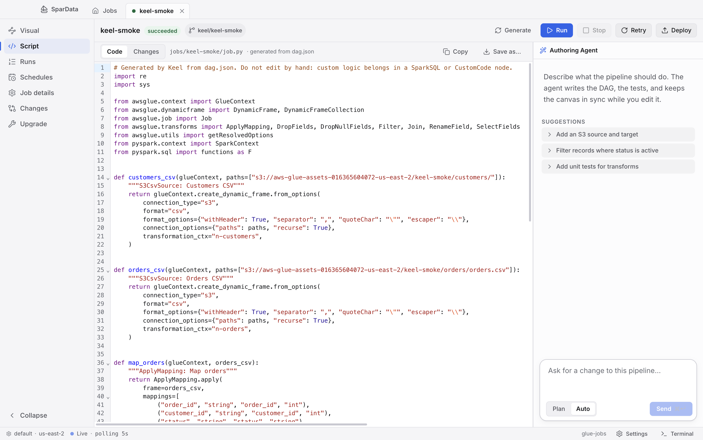
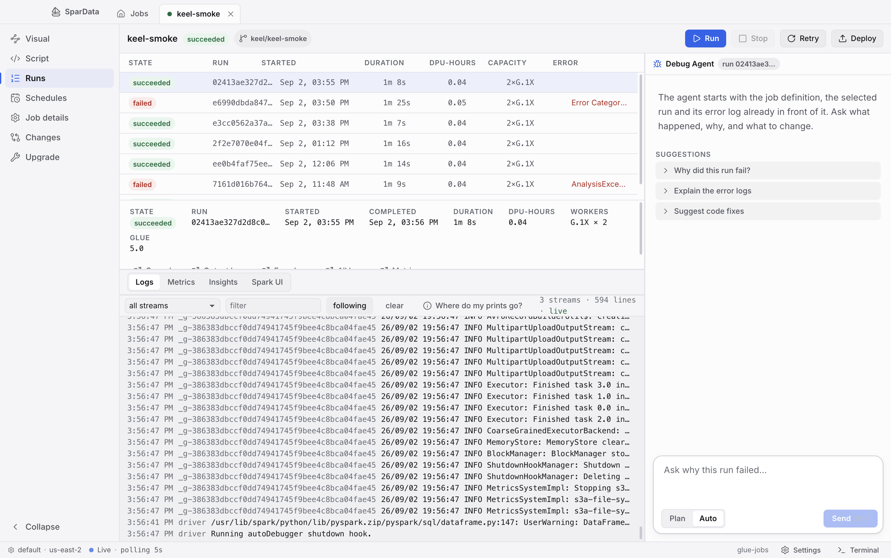
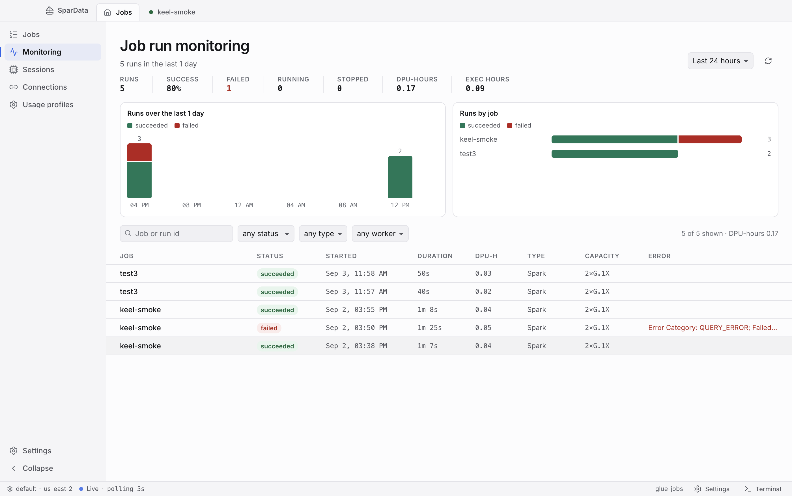

<div align="center">

# ⚡ SparData

### The Local-First Desktop Workbench for AWS Glue & PySpark

**No AWS Console access needed · 100% Local development & testing · Zero added AI cost via Claude Code**

[](https://spardata.dev)
[](https://opensource.org/licenses/MIT)
[](https://github.com/OyadotAI/spar/releases)
[]()
[]()

<br />



<br />

```
   ┌───────────────────────┐          ┌───────────────────────┐
   │    Visual DAG Canvas   │ ◄──────► │   Generated PySpark   │
   │  Sources · Transforms  │          │   100% Glue parity    │
   └───────────┬───────────┘          └───────────┬───────────┘
               │                                  │
               ▼                                  ▼
   ┌──────────────────────────────────────────────────────────┐
   │       Instant Local Container Tests (pytest · 1.4s)      │
   │        No AWS bills · No cloud provisioning wait         │
   └───────────────────────────┬──────────────────────────────┘
                               │
            ┌──────────────────┴──────────────────┐
            ▼                                     ▼
┌───────────────────────┐             ┌───────────────────────┐
│ Zero-Cost AI Agent    │             │   Free Local Spark UI │
│ Uses your Claude Code │             │  Zero S3 setup needed │
└───────────────────────┘             └───────────────────────┘
```

</div>

---

## 🛑 Why Building AWS Glue Jobs in the Cloud is Broken

### 1. Most Engineers Don't Have AWS Console Access
In enterprise and security-conscious companies, developers rarely get IAM web console permissions to log into AWS Glue Studio. You are stuck writing blind scripts or fighting deployment pipelines without an interactive UI.

### 2. Development Shouldn't Cost Money or Waste 5 Minutes
Testing a single line of PySpark or a schema change shouldn't require provisioning cloud DPUs, waiting 2–5 minutes for clusters to initialize, and paying AWS $0.44+/DPU-hour just to hit a trivial `KeyError` or type casting error.

### 3. AI Tooling Shouldn't Add Extra Token Bills
Most AI coding tools charge metered API token markups or require enterprise API keys. Developing data pipelines with AI should just use the tools you already pay for.

---

## 🚀 The SparData Solution

**SparData** ([spardata.dev](https://spardata.dev)) gives data engineers a dedicated local development environment for AWS Glue:

- 💻 **100% Local & Free Development**: Build DAGs, generate PySpark, and run unit tests against sample datasets inside AWS's official Glue 5 container (`public.ecr.aws/glue/aws-glue-libs:5`) in **under 2 seconds**.
- 🔒 **No Web Console Needed**: Author, inspect, and test full visual DAGs locally on your machine without needing AWS IAM console access.
- 🤖 **Zero Added AI Cost**: Connects directly to your existing **Claude Code subscription** (`claude` CLI). No API keys, no extra token charges, and every filesystem/AWS write blocks on human-in-the-loop approval cards.
- 🚀 **Deploy When Ready**: When your pytest suite is green, deploy verified DAGs and PySpark scripts to AWS with one click.

---

## 📸 Screenshots & Highlights

### 🎨 Visual DAG Authoring ↔ Generated PySpark
Build your pipeline visually with full Glue node parity. SparData automatically generates clean, testable PySpark code with isolated functions per transform node.



---

### 📝 PySpark Script View & Instant Diffs
Review clean, formatted PySpark scripts generated from your visual DAG. Track every modification before committing or deploying.



---

### 🔍 Real-Time CloudWatch Run Triage & Logs
Follow live CloudWatch log streams and diagnose failed DPU runs with automated root-cause detection for driver OOMs and schema mismatches.



---

### 📊 Observability & Cost Monitoring
Track execution duration, DPU-hour consumption, failure rates, and job history across your entire AWS account in one unified view.



---

## ✨ Core Superpowers

### ⚡ 1. Local PySpark Simulation & Pytest in Seconds
- Runs your pipeline locally inside AWS’s official container (`public.ecr.aws/glue/aws-glue-libs:5`).
- Scaffolds node-level tests and whole-pipeline pytest suites automatically.
- Validates transforms, schema evolutions, and null-handling on sample data without touching AWS.

### 🎨 2. Bi-directional Visual DAG ↔ Clean PySpark
- Full visual authoring canvas for Glue sources, transforms, and targets.
- Cleanly generates modular, readable PySpark (`job.py`) with node-isolated functions: `def <node_name>(glueContext, <inputs>) -> DynamicFrame`.
- 100% Glue parity — your visual DAGs and deployed scripts stay in sync without locking the editor.

### 🤖 3. Built-In AI Agent (Zero Added AI Cost)
- Drives your local `claude` (Claude Code) CLI directly.
- **Uses your existing Claude subscription** — no separate API keys or surprise metered bills.
- **Human-in-the-loop safeguards**: Risky tool calls (filesystem edits, AWS commands) block on in-app approval cards.
- Autonomously builds pipelines, writes transform logic, generates test fixtures, and diagnoses failures.

### 📊 4. Free Local Spark UI
- Spin up Spark's official History Server on local engine event logs with zero S3 lag.
- Inspect DAG stages, task execution times, memory spill, and partition distributions instantly.
- Also supports streaming and parsing historical S3 event logs from past cloud executions.

### 🔍 5. Automated CloudWatch Error Intelligence
- Real-time CloudWatch log tailing and automated root-cause analysis for failed cloud runs.
- Isolates driver OutOfMemory (OOM) exceptions, schema mismatches, and IAM permission faults in one click.

### 🛡️ 6. Isolated Git Branch & Worktree per Job
- Every job gets its own isolated branch and worktree (`.spar/worktrees/<name>`).
- Safely experiment on separate drafts without polluting your main branch.
- Unified diff view displays uncommitted changes before pushing.

---

## 📦 How a Job Lives on Disk

SparData stores your pipelines in a transparent, git-friendly folder structure:

```text
jobs/<job-name>/
├── job.json        # Glue Job configuration (WorkerType, GlueVersion, Timeout, DefaultArguments)
├── dag.json        # CodeGenConfigurationNodes schema (what the canvas & agent edit)
├── layout.json     # Visual canvas node positions
├── job.py          # GENERATED PySpark script (one function per node + main)
└── tests/          # Pytest suite
    ├── conftest.py          # GlueContext & DynamicFrame test fixtures
    ├── test_<node>.py       # Per-node isolated unit tests
    └── test_pipeline.py     # End-to-end pipeline integration test
```

---

## 🥊 Comparison: AWS Glue Console vs. SparData

| Capability | AWS Glue Console | SparData (`spardata.dev`) |
| :--- | :--- | :--- |
| **Console Access Requirement** | Requires IAM web console login | **Zero console access needed** (Local-first) |
| **Testing Speed** | 2–5 minutes per cloud run start | **&lt; 2 seconds** local container test |
| **Cost per Test** | ~$0.44+ per DPU-hour | **$0.00** (Runs locally on sample data) |
| **AI Cost** | Metered token pricing / API keys | **$0.00 added** (Uses your Claude Code subscription) |
| **Visual + Code Sync** | Locked editor (editing code breaks canvas) | **Bi-directional** visual DAG + PySpark |
| **Spark History UI** | Requires live session billing | **Instant free** local Spark UI |
| **Version Control** | Manual export / CodeCommit | **Automated branch & worktree** per job |
| **Error Triage** | Search across CloudWatch streams | **Automated root cause isolation** |

---

## 🏁 Quickstart

### Option 1: Download the Desktop App
Grab the latest release for macOS, Linux, or Windows from the [Releases page](https://github.com/OyadotAI/spar/releases).

### Option 2: Build from Source

#### Prerequisites
- **Java 21+** (`brew install openjdk@21`)
- **Node.js 20+** & **pnpm** (`npm i -g pnpm`)
- **Docker** (for local Glue 5 test container)
- **AWS CLI** (optional, for cloud sync and deploy)
- **Claude Code** (`npm i -g @anthropic-ai/claude-code`, for AI assistance)

```bash
# Clone the repository
git clone https://github.com/OyadotAI/spar.git
cd spar

# Run the test suite gate (JUnit + TypeScript + Vitest)
make check

# Launch the app in development mode
make dev
```

---

## 🛠️ Architecture

SparData is built with a high-performance local architecture:
- **Core Engine (Daemon)**: Java 21 / Spring Boot running on loopback (`127.0.0.1`). Drives the `claude` CLI, executes containerized tests via Docker, manages Git worktrees, and communicates with AWS Glue & CloudWatch over AWS SDK v2.
- **Renderer (UI)**: Electron desktop app built with React 19, TypeScript, Vite, CodeMirror 6, React Flow, and Lucide icons.
- **Communication**: Virtual-thread Server-Sent Events (SSE) and WebSockets.

---

## 🤝 Community & Contributing

Contributions, bug reports, and feature requests are welcome!

- 🌐 **Website**: [https://spardata.dev](https://spardata.dev)
- 🐙 **GitHub Repository**: [https://github.com/OyadotAI/spar](https://github.com/OyadotAI/spar)
- 🐛 **Issues**: [Report a bug](https://github.com/OyadotAI/spar/issues)

---

## ⚖️ Disclaimer

**SparData is an independent open-source project and is not affiliated with, endorsed by, or sponsored by Amazon Web Services (AWS) or Amazon.com, Inc.**

Built by developers who love AWS Glue and Apache Spark, but wanted a fast, local-first developer experience instead of wrestling with the AWS web console.

---

## 📄 License

SparData is open-source software licensed under the [MIT License](LICENSE).
